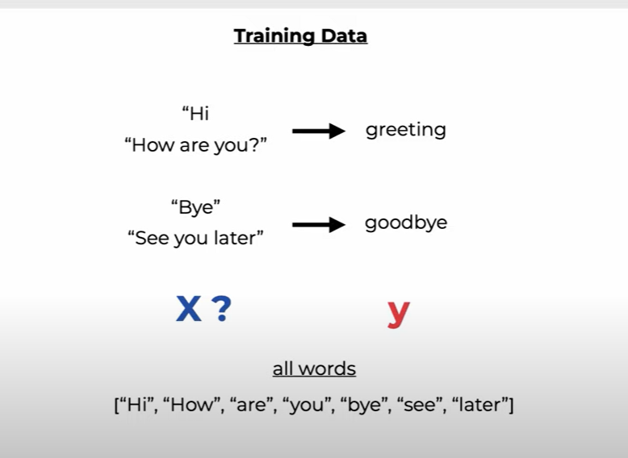
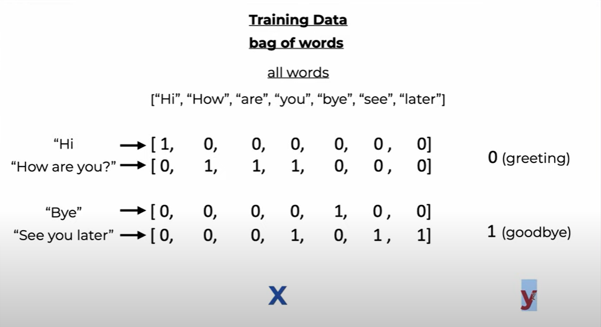
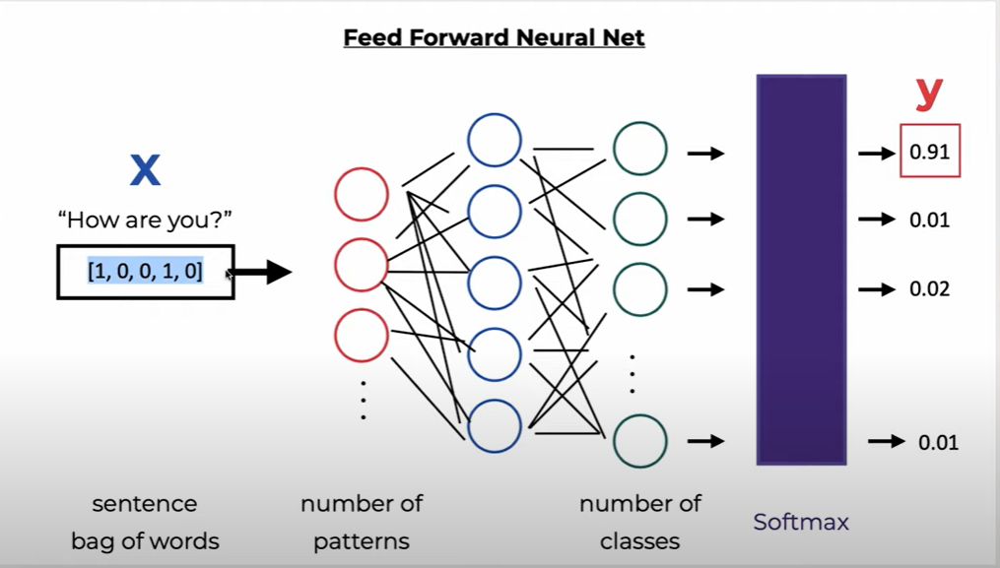
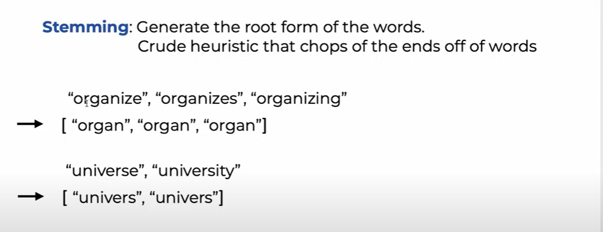
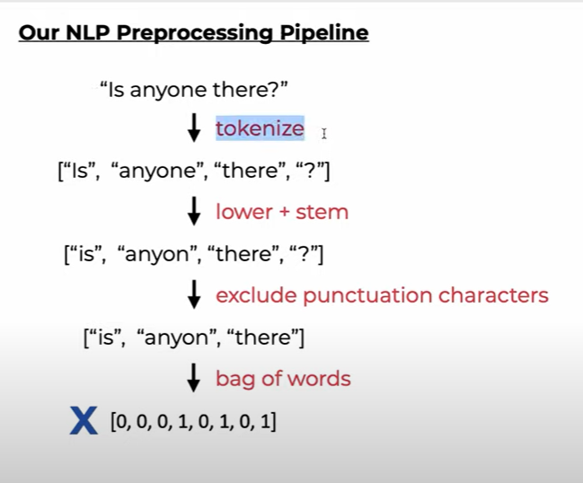

# nlp-pytorch-chatbot

Các bước xây dựng project này:

## 1) Theory + NLP concepts (stemming, tokenization, bag of words)

Tổng quan mô hình cần làm:

Với các câu bên trái, ta mong muốn phần loại chúng vào các loại câu. Ví dụ:

- Các câu `Hi`, `How are you?` sẽ được phần loại vào class `greeting`

- Các câu `Bye`, `See you later` sẽ được phân loại vào class `goodbye`

Để có thể ứng dụng mô hình `Neural network` vào đây, ta không thể để nguyên các câu mà sử dụng được mà ta cần phải mã hóa các câu dựa trên tập các từ tìm được từ tất cả các câu.

Vậy việc đầu tiên ta cần làm đó là tìm `bag of words`

### a) Bag of words

`Bag of words` là vector với các phần tử là các từ khác nhau được lấy ra từ tất cả các câu trong dataset.

Ví dụ với 4 câu trên, ta tìm được ra bộ các từ `Hi, How, are, you, bye, see, later` và từ đó thành lập được `bag of words`.

Mục đích của `bag of words` đó chính là giúp chúng ta mã hóa các câu thành các vector có giá trị các phần tử chính là số lần xuất hiện của các từ trong `bag of words`.

Bằng việc mã hóa như vậy ta đã được các `inputs` dưới dạng các vector.

Các class `greeting, goodbye...` được gán cho các giá trị số khác nhau để phân biệt. Thường thì sau đó ta sẽ dùng `one-hot encoding` để mã hóa tiếp các giá trị số này.

=> Với các `inputs` và `labels` như trên ta sẽ xây dựng được mạng `Neural Network`:

**Các kĩ thuật tiền xử lý cho các câu, từ có thể nhắc đến là:**

### b) Tokenization

- Đây là kĩ thuật splitting chuỗi (câu) thành các `meaningful units` (các từ, dấu câu, số)

### c) Stemming

Đây là kĩ thuật tạo ra `root form` của các từ 

### d) NLP preprocessing pipeline

## 2) Create training data

## 3) Model and training

## 4) Save/ load model and implement the chat